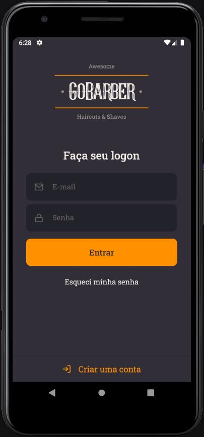

<h1 align="center" >
  
   
   
  GoBarber
</h1>

<h4 align="center">
  App to schedule haircuts, developed with RocketSeat
</h4>

  <a href="#rocket-technologies">Technologies</a>&nbsp;&nbsp;&nbsp;|&nbsp;&nbsp;&nbsp;
  <a href="#information_source-how-to-use">How To Use</a>

  

  

<h3>
  You can see the design on <a href="https://www.figma.com/file/BXCihtXXh9p37lGsENV614/GoBarber">Figma</a>
</h3>
